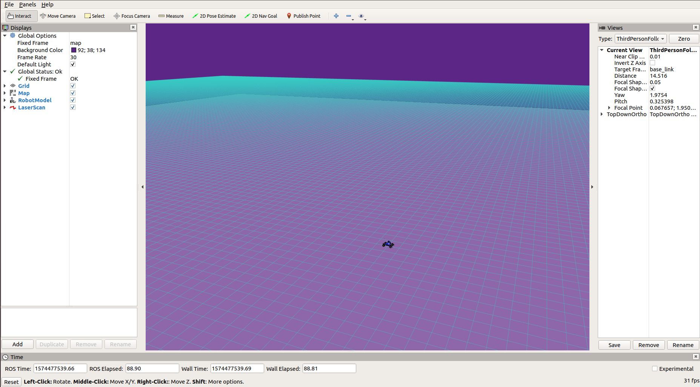

# Homework 1: Introduction

## Overview:


The goal of this assignment is to help you become acquainted with the platforms and other software you’ll use in the programming projects. Please complete this project on your own, so that everyone will have a solid foundation for future projects.

First, you’ll set up the course environment and learn about ROS (including some brief refreshers on using the terminal). Then, you’ll write Python code to interface with ROS, and learn to use the NumPy library to write computationally-efficient code. 

## \# Q1. Your First Publisher Node: prime number (30 pts)

Recall that [publishers and subscribers](http://wiki.ros.org/rospy/Overview/Publishers%20and%20Subscribers) are how ROS manages interprocess communication. Publishers send out messages to a topic, while subscribers choose a topic to receive messages from. Publishers and subscribers can even be on different machines in a network, although we won’t take advantage of that feature in these projects.

We will be creating a simple ROS node that check wether an input number is a prime number. It will read an input number from a ROS parameter and publish a boolean value (True, if input number is a prime number, or False, if not) to a ROS topic. For example, 7 is a prime number, and the publisher should publish True. 1234 is not a prime number, and the publisher should publish False.

**Q1.1**: Implement the `is_prime_number` function in `hw1_introduction/src/introduction/prime_number.py`. Make sure your implementation is correct before proceeding to the next question. Your code should pass all tests in `test_prime_number.py`.

To test your code, run
```
$ roscd introduction
$ python3 test/test_prime_number.py
```
<details>
<summary>Rubric</summary>
There are two tests in test_prime_number.py, each test is worth 5 points
</details>

**Q1.2**: We’ve provided an annotated code skeleton to interface with ROS at `hw1_introduction/scripts/prime_number`. Follow the instructions inline to complete the code. Your implementation should now also pass `rostest introduction prime_number_small.test`.

<details>
<summary>In case you come across the error "FAILURE: Test node [introduction/test_prime_number_small.py] does not exist or is not executable" </summary>
This is because you need to enable access to the said executable using chmod:

```
$ chmod +x ~/homework_ws/src/cs4750_student/hw1_introduction/test/test_prime_number_small.py
```

 Please do the same for other executables for which this error arises in the future.
</details>

<details>
<summary>Rubric</summary>
15 points for passing prime_number_small.test
 </details>
 
**Q1.3**: Finally, we will write a launch file for our node to make it easier to run, and provide different inputs to `is_prime_number`. Since `hw1_introduction/scripts/prime_number` reads the input from the "~test_number" parameter from ROS, you will need to pass it to your node in your launch file. We have provided an annotated skeleton in `hw1_introduction/launch/prime_number.launch`. Follow the inline instructions to complete the launch file.


Let’s run the publisher node and see its output directly. After launching roscore, listen to the output topic. Then, start your prime number node using `prime_number.launch`. You should see the boolean value appear on the `/introduction/prime_number_output` topic in terminal 2! You can then run the prime number node with different input values. Here are the commands to run:
```
$ # In terminal 1
$ roscore
$ # In terminal 2 
$ rostopic echo /introduction/prime_number_output
$ # In terminal 3
$ roslaunch introduction prime_number.launch
$ roslaunch introduction prime_number.launch test_number:=12
```

<details>
 <summary>Rubric</summary>
 We will grade this manually. This should be very simple, so you will get 5 points if correct or 0 point
if incorrect.
 </details>

## \# Q2. Running the MuSHR Car in Simulation
This section will show you how to run the MuSHR simulator and visualize what is going on. Simulators are important because they allow you to test things quickly and without the risk of damaging a robot, the environment, or people. Our simulator uses a kinematic car model (with some noise sprinkled in), meaning it simply implements and integrates some equations that describe the ideal motion of a mechanical system. It will not perfectly reflect the real world dynamics of the car. Regardless, it is still useful for a lot of things.

We’ll run the simulator using a **launch file**. These are XML files that describe how different software components should be started. These files allow us to start a large number of ROS nodes with only few commands. To launch our simulator, open a terminal and run:
```
$ cd ~/homework_ws/
$ source ~/homework_ws/devel/setup.bash
$ roslaunch cs4750 teleop.launch
```
Moving forward, we won’t always spell out that you’ll need to source the `homework_ws` workspace to do something. But remember that you can’t interact with ROS without having activated a workspace in your terminal. If you try to roslaunch and your terminal says “Command ‘roslaunch’ not found”, you probably forgot to activate the workspace!

Like many `rosXXX` terminal commands, the first argument is the name of a package, and the second is the name of something inside that package (in this case, a launch file).

A small gray window should appear. The simulation is running, you just can’t see it yet!

Let’s try to convince ourselves of this. Open another terminal and run `rosnode list` to see all of the nodes running. Each of those nodes is a separate process. We can see the communication between nodes by examining the **topics** they are **publishing messages** to and **subscribing to** messages from. Messages are packets of information in a specific format that can be routed around a ROS system. Running `rostopic list` will display the names of all the open topics. We can actually see the simulation in action if we look at some of the messages coming from the simulated hardware. Let’s use the `rostopic` helper to view these messages:

```
$ rostopic echo /car/odom
```

Messages will start streaming into your terminal. Now focus on the gray teleop window and use the WASD keys to send commands to the vehicle. W and A move forward and backward, S and D turn the steering wheel left and right. Notice how the numbers are changing in response to your commands?

To stop the simulation, press `<Ctrl-C>` in the `teleop.launch` terminal window.

## \# Q3. Visualizing the Simulator

Start the simulation again:
```
$ cd ~/homework_ws/
$ source ~/homework_ws/devel/setup.bash
$ roslaunch cs4750 teleop.launch
```
To visualize the simulation, open up a separate terminal and run:
```
$ rosrun rviz rviz -d ~/homework_ws/src/cs4750_student/cs4750/config/default.rviz
```
If you see error messages in your terminal like “Could not load model…”, remember to source your workspace!

This will launch RViz with a configuration that has all the right topics visualized. A window like this should appear:

 <figure>
  
<!--   <figcaption>RViz visualizer.</figcaption> -->
</figure> 

To drive the car, click on the small gray window and use the WASD keys.

In RViz, you will notice multiple panels. The right panel is the views panel. The “Target Frame” option tells the camera what to focus on. If you don’t want it to track the car, you can change it from “base_link” to “map”. The center panel is the view panel; you can zoom, pan, and rotate using the mouse and mouse wheel.

The top panel has a few tools, like Measure and 2D Pose Estimate. 2D Pose Estimate is particularly useful if you want the numerical coordinates of a given position. Just click on it, then click on the map. The terminal that you started RViz in will display the coordinates. You may also notice the car model is relocated there; the simulator listens to the message RViz sends and sets the car position to match.

Finally, the left panel shows all of the ROS topics that RViz is subscribed to. For example, if you toggle off the checkbox for the Map topic, you will no longer see the map visualization (although it’s still being used by the simulator). You can add additional topics by clicking the “Add” button then “By topic”. Try adding the origin axes by adding a topic “By display type”. You will mainly add “By topic” but “By display type” may be useful in situations where the list of topics is too long to look through.

Remember, RViz is a visualizer, not a simulator. You can close RViz, but just like how the world continues when you close your eyes, the simulator will chug ahead. So far, we’ve been using RViz to visualize the ROS data being emitted by the simulator. In other situations, the information could come from the software running on a physical robot.

When you close RViz, it may prompt you to save your changes. Saving in RViz saves the RViz configuration, not the state of the simulator itself. Unless you’ve added new topics that you want visualized when RViz starts up, you probably don’t need to save those changes.


<details>
<summary>Customize Rviz</summary>

If you launch RViz with:

```
$ rviz
```

RViz will load its default configuration (which usually is empty). Try adding the topic that you are interested in, saving the RViz configuration (“File > Save Config”), and relaunching RViz. You should find all of the panels open in the same position, and all parameters like the topics being visualized or the camera position set to the same settings as before.
</details>


## \# Q4: Your First Subscriber: PoseListener (50 pts)
In this question, we’ll combine ROS with the [NumPy](https://numpy.org/doc/stable/user/quickstart.html) and [Matplotlib](https://matplotlib.org/) scientific computing libraries. NumPy makes computations faster by using vectorization, and Matplotlib creates plots and other data visualizations.

We will compute the [Manhattan Norm](https://mathworld.wolfram.com/L1-Norm.html) in two ways: with regular Python for loops and with functions from NumPy. The input will be a 2D NumPy array of shape (N, D), which contains N vectors each of dimension D. The expected output will be a 1D NumPy array of shape (N,), where each entry is the Manhattan norm of the corresponding vector. For example:


**Q4.1**: Complete the `norm_python` function in `hw1_introduction/src/introduction/listener.py`. To index into a 2D array, NumPy extends the Python indexing syntax to take in multiple indices, with one for each dimension. If `data` represents the left matrix above, `data[0, 0]` returns 3 and `data[2, 1]` returns 15. Use Python for loops to compute the Manhattan norm and replace the zero entries in `norm`. Try to use the NumPy function [np.absolute](https://numpy.org/doc/stable/reference/generated/numpy.absolute.html).


**Q4.2**: In the same file, complete the `norm_numpy` function. 
Try to use the NumPy function [np.linalg.norm](https://numpy.org/doc/stable/reference/generated/numpy.linalg.norm.html).

After completing Q4.1 and Q4.2, expect your code to pass the following test suite:
```
$ rosrun introduction test_norms.py
```

<details>
 <summary>Rubric</summary>
There are 4 tests in 'test_norm.py', 5 points each
 </details>
 
Run `rosrun introduction compare_norm` to compare the running time of your two implementations on 100 trials. This script will use matplotlib to plot the mean and standard deviation of your run time. Save the figure as `runtime_comparison.png`. 

**Q4.3**: In the `PoseListener` class in the same file, initialize a subscriber `self.subscriber` to the car’s pose topic. To do so, you will need to pass the topic’s name, the message type being published and a callback function. Each time the subscriber receives a message, it will call the callback function to process the message data.

To find the right topic name to subscribe to, launch the car simulation again and run `rostopic list` to see all the topics being published. There’s one topic containing “car_pose” in its name. To figure out what type of messages are being sent on that topic, use `rostopic info XXX/car_pose`. When you construct the subscriber, pass `self.callback` as the callback function.

**Q4.4**: Fill in the `PoseListener.callback` method by extracting the x and y position from the pose messages, then saving them in `self.storage`. To see what a car pose message looks like, run your car in the simulator and `rostopic echo XXX/car_pose`. Alternatively, you can look up the message type being published online to see its fields. Expect your code to pass the last test suite, `rostest introduction pose_listener.test`.

<details>
 <summary>Rubric</summary>
Once you implement both 4.3, 4.4, your code is expected to pass `pose_listener.test`, which is worth
30 points.
 </details>
 
**Q4.5**: Now, let’s use the `PoseListener` to actually collect some data! In `hw1_introduction/scripts/pose_listener`, we’ve already used matplotlib to plot the xy-locations of your car and save the resulting plot to `locations.png`. Use your norm_numpy function to compute the Manhattan Norm for all the xy-locations of the car captured by the `PoseListener`. Then, use `matplotlib` to plot these Manhattan Norms in order such that the y-axis is Manhattan Norm values and the x-axis is an index array 0..N-1 (which is a proxy for time). Save the resulting plot to 'norms.png'.

First, start `teleop.launch` with the default `sandbox.yaml` map.

```
$ roslaunch cs4750 teleop.launch map:='$(find mushr_sim)/maps/sandbox.yaml'
```
**Or** if you previously set the MAP environment variable in your terminal or .bashrc file
```
$ export MAP='$(find mushr_sim)/maps/sandbox.yaml'
$ roslaunch cs4750 teleop.launch
```

Second, to visualize the simulation in `rviz`, open up a separate terminal and run:
```
$ rosrun rviz rviz -d ~/homework_ws/src/cs4750_student/cs4750/config/default.rviz
```

Finally, you can use the following launch configuration, which starts a `path_publisher` node (that will make the car follow a trajectory specified in a file) and your subscriber node. While passing the plan file, you can see the car’s movement in `rviz`.
```
$ # In a separate shell
$ roslaunch introduction path_publisher.launch plan_file:='$(find introduction)/plans/XXX.txt'
```
  > Run the above configuration with the figure_8.txt and crown.txt plan files. For both plans, save the figures produced by pose_listener for submission: locations.png and norms.png. 

  > Optional: Let your artistic side shine and create your own plan file! If you do, please submit the plan file (and any code you may have used to generate it), as well as the locations.png producted by pose_listener. 

## Deliverables (25 pts for graduate, 20 for undergraduate)
Answer the following writeup questions in hw1_introduction/writeup/README.md.
<ol>
<li> Define in your own words what a node, topic, publisher, and subscriber are and how they relate to each other.</li>
<li> What is the purpose of a launch file? </li>
<li> Include the RViz screenshot showing the car. </li>
<li> Include your runtime_comparison.png figure for the different norm implementations. </li>
<li> Include the locations.png and norms.png figures for the plan figure_8.txt. </li>
<li> Include the locations.png and norms.png figures for the plan crown.txt. </li>
<li> Optional for undergrad, mandatory for graduate: Include your own plan file, any code you wrote to generate it, and the resulting locations.png figure. </li>
</ol>

<details>
<summary>Rubric</summary>

+ Q1: 3 points.
+ Q2: 3 points.
+ Q3: 2 point.
+ Q4: 2 points
+ Q5, Q6: 2.5 pts for each picture.
+ Q7: 5 points for graduate, glory for undergraduate
</details>

### Submission 

zip hw1_introduction folder and submit to Gradescope.
