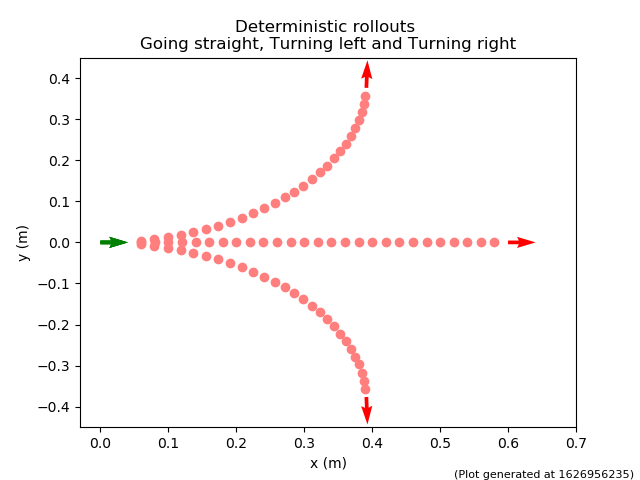
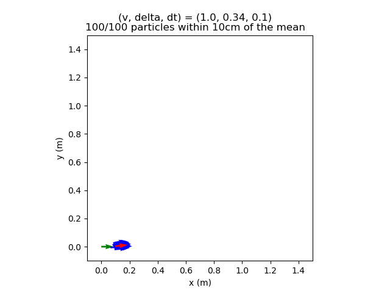
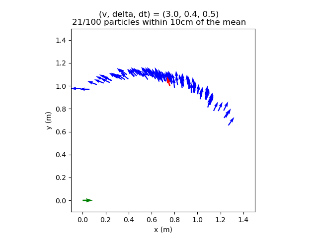
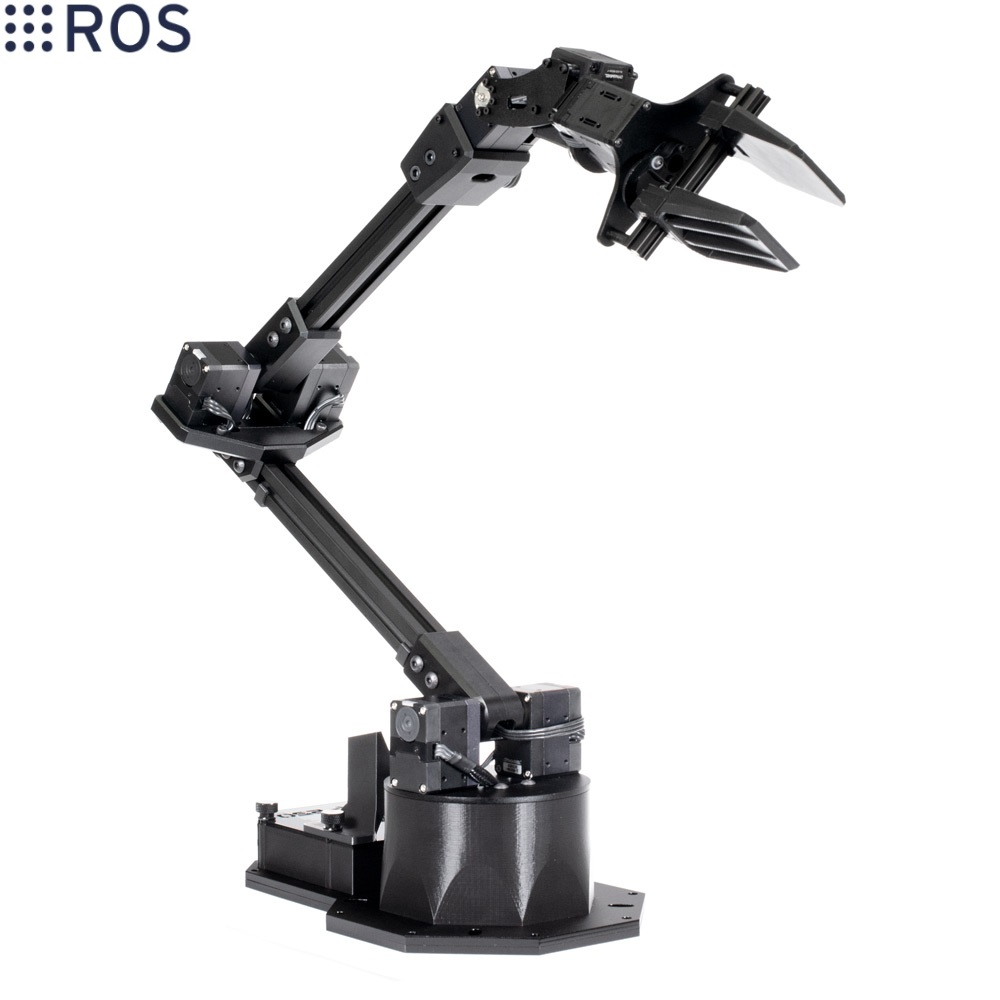
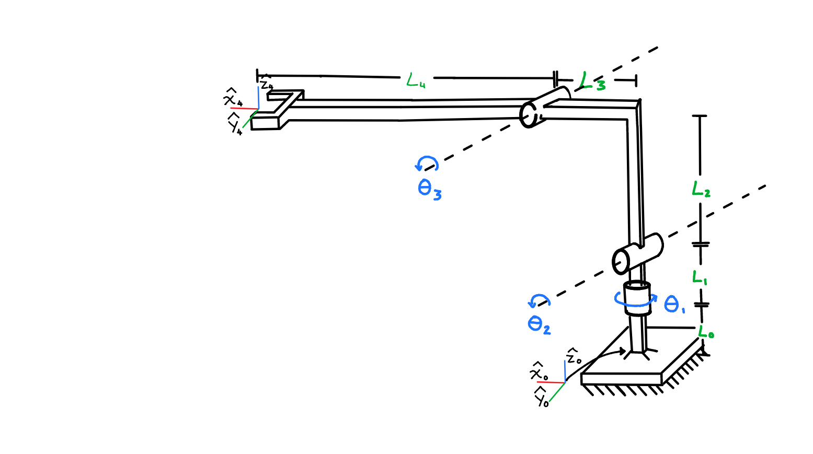

# Homework 2: Kinematics

## Download code base

```
cd ~/  
git clone https://github.coecis.cornell.edu/fb266/foundations_of_robotics_fa21.git TODO
cd foundations_of_robotics_fa21 && cp -r hw2_kinematics ~/homework_ws/src   
cd ~/homework_ws && catkin build
```

## \# Car Kinematics
In this part of the assignment, you will work with the MuSHR platform. The goal is to implement the kinematics model of the MuSHR car in 2D.

**Q1**: Kinematics car model

**Q1.1 (20 points)** Kinematics model derivation
Let’s first review the kinematic model of the car and annotate the relevant lengths and angles (add figure).
First, let’s assume that there is no control and that the velocity was stable and the steering angle is <em>zero</em>. We can then write out the change in states:

<figure>

<figcaption align = "center"><b>Figure 1: Ackermann steering, or car-like steering</b></figcaption>
</figure>


$$
\begin{align*}
&\dot{x} = v \cos \theta \\
&\dot{y} = v \sin \theta \\
&\dot{\theta} = \omega
\end{align*}
$$
    
where $\omega$ is the angular velocity from the center of rotation to the center of the rear axle.
By the definition of angular velocity:
    
$$
\omega = \frac{v}{R} = \frac{v}{L} \tan \alpha
$$
    
Formally, the changes in states are:
    
$$
\begin{align*}
&\frac{\partial x}{\partial t} = v \cos \theta \\
&\frac{\partial y}{\partial t} = v \sin \theta \\
&\frac{\partial \theta}{\partial t} = \frac{v}{L} \tan \alpha
\end{align*}
$$

You will now derive the update to state $\mathbf{x} \_{t-1}$
after applying control $\mathbf{u}\_t$ 
to obtain $\mathbf{x}\_{t}$ by integrating over the time step. The update rule for $\theta\_{t-1}$ is done for you below:

$$
\begin{align*}
&\int_{\theta_{t-1}}^{\theta_{t}}d\theta =
\int_{t}^{t+\Delta t} \frac{v}{L} \tan \alpha dt \\
&\theta_{t}-\theta_{t-1} =\frac{v}{L} \tan \alpha \Delta t \\
&\theta_{t} = \theta_{t-1} + \frac{v}{L} \tan \alpha \Delta t \\
\end{align*}
$$

Changes in positions: 

$$
\int_{x_{t-1}}^{x_{t}} d x
= \int_{t}^{t+\Delta t} v \cos \theta d t
= \int_{\theta_{t-1}}^{\theta_t} v \cos \theta \frac{d \theta}{\frac{v}{L} \tan \alpha}
= \frac{L}{\tan \alpha} \int_{\theta_{t-1}}^{\theta_{t}} \cos \theta d \theta
$$

$$
x_{t}-x_{t-1} = \frac{L}{\tan \alpha}\left[ \sin \theta_{t} - \sin \theta_{t-1} \right]
$$

$$
\int_{y_{t-1}}^{y_{t}} dy
= \int_{t}^{t+\Delta t} v \sin \theta d t
= \int_{\theta_{t-1}}^{\theta_t} v \sin \theta \frac{d \theta}{\frac{v}{L} \tan \alpha}
=\frac{L}{\tan \alpha} \int_{\theta_{t-1}}^{\theta_{t}} \sin \theta d \theta
$$

$$
y_{t}-y_{t-1} =\frac{L}{\tan \alpha} \left[ -\cos \theta_{t} + \cos \theta_{t-1} \right]
$$

Putting it all together:

$$
\begin{align*}
&\theta_{t} = \theta_{t} + \frac{v}{L} \tan \alpha \Delta t \\
&x_{t}
= x_{t-1} + \frac{L}{\tan \alpha} \left[ \sin \theta_{t} - \sin \theta_{t-1} \right] \\
&y_{t}
= y_{t-1} + \frac{L}{\tan \alpha} \left[ -\cos \theta_{t} + \cos \theta_{t-1} \right] \\
\end{align*}
$$

Please show your derivation process in your `/car_kinematics/README.md`. You may do this either by embedding Latex or taking a picture of your handwritten work (any illegible work will not be graded).


**Q1.2 (25 points)** Implement the kinematic car equations in the `KinematicCarMotionModel.compute_changes` method (`src/kinematics/kinematic_model.py`). Note that this method is deterministic: given initial state $\mathbf{x}_{t-1}$ and control $\mathbf{u}_t$, it integrates the kinematic car equations and returns a new state $\mathbf{x}_t$.

Hint: Note that in our provided code, `states` has shape (M,3), and `control` has shape (M, 2). Think it as we have M possible states for our car, and we have one command for every possible state (hence M commands in total). For example, the state represented by the first row of `states` will be applied with the control command represented by the first row of `control`. You will end up with a output array with shape (M, 3) that representing the change in states.

<details>
<summary>
What if the steering angle is 0?
</summary>

The update rule we derived divides by $\tan \alpha$, which means we’re dividing by 0 if the steering angle is 0. (Mathematically, the center of rotation is now infinitely far away.) Fortunately, the update rule becomes even simpler for this case: if there’s no steering angle, the car continues driving at angle $\theta$ with velocity $v$.

$$
\begin{align*}
&\theta_{t} = \theta_{t-1} \\
&x_{t} = x_{t-1} + v \cos \theta \Delta t\\
&y_{t} = y_{t-1} + v \sin \theta \Delta t
\end{align*}
$$

In your implementation, you should treat any steering angle where $| \alpha |$ is less than `alpha_threshold` as a zero steering angle.
</details>

You can verify your implementation on the provided test suite by running 
```
roscd car_kinematics/
python3 test/kinematic_model.py
``` 

Your code should pass all test cases starting with `test_compute_changes`.

After successfully implementing the kinematic car equations, we would want to propogate the changes (obtained using `KinematicCarMotionModel.compute_changes`) across states to generate the motion of our car.
<details>
<summary>Rubric</summary>
+ For <b>Q1.2</b>, 25 points if all test cases starting with `test_compute_changes` pass.
</details>
<br>

**Q1.3 (20 points)**: Implement the simple deterministic motion model in the `KinematicCarMotionModel.apply_deterministic_motion_model` method (`src/kinematics/kinematic_model.py`).  Your implementation should also map the resulting $\theta$ component of the state to the interval $(-\pi, \pi]$. Angles that differ by a multiple of $2\pi$ radians are equivalent. For example, if the resulting $\theta$ component was $\theta = \frac{3\pi}{2}$, your implementation should return the equivalent angle $\theta = -\frac{\pi}{2}$.

After completing **Q1.3**, you should pass all test cases starting with `test_apply_deterministic`.

<blockquote>
Remember the plot you generated for Project 1 comparing the <code>norm_python</code> and <code>norm_numpy</code> computation times? Your implementations for Q1.2, Q1.3, and subsequently Q1.4 should be <em>vectorized</em> using <a href="https://numpy.org/doc/stable/reference/arrays.indexing.html">NumPy indexing</a>, rather than iterating over each <b>particle</b> (representing the state) with Python for loops. (Both the “Basic Slicing and Indexing” and “Advanced Indexing” sections of that page are useful, but <a href="https://numpy.org/doc/stable/reference/arrays.indexing.html#boolean-array-indexing">Boolean array indexing</a> will be particularly useful when thresholding $\alpha$.)
</blockquote>
<br>
We've provided a script to visualize the motion of a car using the deterministic model.

```
rosrun car_kinematics make_rollout_plot
```

The staff solution produces the following plot after running the command above. Try to match these plots by correctly implementing the `apply_deterministic_motion_model` method.
<figure class="figure mw-100 w-500px">
     
    <figcaption align = "center"><b>Figure 2: Rollouts generated using the deterministic motion model. The initial state (green arrow), final state (red arrow) and the intermediate states from integrating the deterministic model (red dots).</b></figcaption>
</figure>
<br/><br/>
Next, to make this simple kinematic model robust to various sources of modeling error, you’ll add noise in three steps. Noise is parameterized by $\sigma_v, \sigma_\alpha$ (action noise) and $\sigma_x, \sigma_y, \sigma_\theta$ (model noise).

<ol type="1">
<li>

Given <em>nominal</em> controls $\mathbf{u}\_t = (v_t, \alpha_t)$, sample <em>noisy</em> controls $\hat{\mathbf{u}}\_t = (\hat{v}\_t, \hat{\alpha}\_t)$ where $\hat{v}\_t \sim \mathcal{N}(v_t, \sigma_v^2)$ and $\hat{\alpha}\_t \sim \mathcal{N}(\alpha_t, \sigma_\alpha^2)$.</li>
<li>

Integrate kinematic car equations with noisy controls $\Delta \hat{\mathbf{x}}\_t = \int\_{t-1}^t f(\mathbf{x}\_{t-1}, \hat{\mathbf{u}}\_t) dt$ (by calling the `compute_changes` method).</li>
<li>

Add model noise to the output $\Delta \mathbf{x}\_t \sim \mathcal{N}(\Delta \hat{\mathbf{x}}\_t, \mathrm{diag}(\sigma_x^2, \sigma_y^2, \sigma_\theta^2))$.
</ol>
<details>
<summary>Rubric</summary>
+ For <b>Q1.3</b>
    + 10 points if all test cases pass. 
    + 10 points for matching the output in Figure 2.
</details>
<br>

**Q1.4 (15 points)**: Reuse the code written in `KinematicCarMotionModel.apply_deterministic_motion_model` method and implement a noisy motion model in the `KinematicCarMotionModel.apply_motion_model` method (`src/car_kinematics/kinematic_model.py`). There is an instance attribute corresponding to each noise parameter: `vel_std` corresponds to $\sigma_v$, `alpha_std` corresponds to $\sigma_\alpha$, etc. These instance attributes can be accessed with dot notation, e.g., `self.vel_std`.
After completing Q1.1, Q1.2, Q1.3, Q1.4, expect your code to pass all the test cases in `test/kinematic_model.py`.
<details>
<summary>Rubric</summary>
+ For <b>Q1.4</b>, 15 points if all test cases pass.
</details>
<br>

## [Optional for CS 4750, ECE 4770, MAE 4760 but required for CS 5750] Exploring the Motion Model Parameters (10 points)

**Bonus Points**: The noise in this motion model is controlled by the parameters $\sigma_v, \sigma_\alpha$ (action noise) and $\sigma_x, \sigma_y, \sigma_\theta$ (model noise). We’ve provided some initial values in `config/parameters.yaml`, but it’ll be up to you to tune them and make sure they’re reasonable. We’ve provided a script to visualize samples from your probabilistic motion model, under the current noise parameters in `config/parameters.yaml`.

```
rosrun car_kinematics make_motion_model_plot
```

The staff solution produces the following plots with our motion model that is tuned to match the physical MuSHR car. Try to match these plots by tuning your parameters.
<figure class="figure mw-100 w-500px">
     
    <figcaption><b>
        Figure 3: The initial state (green) and state from integrating the deterministic model (red). Particles (blue) after moving forward and slightly to the left.
        </b></figcaption>
</figure>

<figure class="figure mw-100 w-500px">
     
    <figcaption><b>
        Figure 4: Particles (blue) after moving forward and to the left. This banana-shaped curve is expected when noise is added to the system.
    </b></figcaption>
</figure>

> In `scripts/make_motion_model_plot`, look at the `example_cases` dictionary that generates these two plots. Each key of this dictionary is a tuple of nominal velocity, nominal steering angle, and duration to apply those nominal commands. Why does the motion model produce more particles within 10cm of the deterministic model prediction in Figure 3 than Figure 4?

The key to tuning is first understanding how each parameter affects the model.

>Tune your motion model parameters to match the staff parameters. To explain your tuning process, please save three versions of the figure with (3.0, 0.4, 0.5) that were generated by different parameters (`mm1.png`, `mm2.png`, `mm3.png`). In your writeup, explain what’s different between your plot and Figure 4 above, and how you’re changing the parameters in response to those differences. (Your last figure doesn’t need to match ours exactly.)

<details>
<summary>Rubric</summary>
+ <b>[Optional (required for 5000 level students]</b>, 10 points. "Exploring the Motion Model parameters" -- Save correct figures and answer the questions in the README. 
</details>
<br>

## \# Arm Kinematics
### Overview
In this assignment, you will work with an 6 dof arm robot called [WidowX 250](https://www.trossenrobotics.com/widowx-250-robot-arm.aspx). 

<figure>
  
  <figcaption> picture src: https://www.trossenrobotics.com/widowx-250-robot-arm.aspx </figcaption>
</figure> 

**Q2.1 (20 points)** : Write the D-H parameters of the robot arm in your README. You should follow the conventions we discussed in class. We provide the initial and end-effector frames. You **ONLY** need to come up with the D-H parameters for frames 1, 2, and 3. Do **NOT** create any additional frames. The joints in this drawing represent the waist, the shoulder, and the elbow of the robot arm (more on this in **Q2.2**).
<figure>
  
</figure> 

**SOLUTIONS:**

<figure>
  
  <figcaption> D-H parameter frame assignment. </figcaption>
</figure> 

L0 = 0.072

L1 = 0.039

L2 = 0.25

L3 = 0.05

L4 = 0.409

$\psi = \operatorname{tan}^{-1}(0.05/0.25)+\frac{\pi}{2} $

or

$\psi = \operatorname{arctan2}(0.25, -0.05) $
        
|  i  |     $\alpha_{i-1}$      |         $a_{i-1}$      |    $d_i$    |            $\phi_i$           |
| --- | ----------------------- | ---------------------- | ----------- | ----------------------------- |
|  1  |            0            |            0           | $L_0 + L_1$ |         $\theta_1+ \pi$       |
|  2  |      $\frac{\pi}{2}$    |            0           |      0      |      $\theta_2 + \psi$        |
|  3  |            0            | $\sqrt{L_2^2 + L_3^2}$ |      0      |    $\theta_3 + (\pi - \psi$)  |
|  4  |      $\frac{\pi}{2}$    |           $L_4$        |      0      |             0                 |

<details>
<summary>Rubric</summary>
+ 20 points: D-H parameters are correct
</details>
<br>

### Visualize your workspace for the WidowX arm


Feel free to run the launch file and have a look at your workspace.
```
# in terminal 1
$ roslaunch arm_kinematics fk.launch
```
You should see both `rviz` and `joint_state_publisher_gui` (might be behind rviz window) being launched. `joint_state_publisher_gui` allows you to use sliders to control all joint values. Feel free to play around with it.


To simplify computation, we will treat this arm as a 4 link robot. Each link is assigned a different color. 

<!-- + Base link: black
+ Shoulder link: blue
+ forearm link: green
+ gripper link: dark blue -->

You will also see a frame called `fk_frame` that is alone in the wild. `fk_frame`'s location is computed based on your implementation of forward kinematics, and your task is to implement forward kinematics from `wx250s/base_link` to `wx250s/ee_gripper_link` so that `fk_frame` is perfectly aligned with `wx250s/ee_gripper_link`. It is currently **NOT** aligned with `wx250s/ee_gripper_link` because the code performing the forward kinematics is unimplemented.

On the left panel of Rviz, you will find a dropdown menu for [`TF`](http://wiki.ros.org/tf) package (shown below). This package allows you to keep track of multiple coordiante frames, and you will encounter this many times during the course. Take a look at the [website](http://wiki.ros.org/tf), and you might find many tools useful for debugging. 

As you can see in the image below, you can choose to visualize other frames. We have by default only enabled `base_link`, `ee_gripper_link`, and `fk_frame`.

**n.b.** The TF coordinate frames displayed on rviz are **NOT** aligned with the coordinate frames assiged to the joints following D-H parameters. In other words, while you may use these TF coordinate frames to check if the origin of `fk_frame` is aligned with one of the TF frames, do **NOT** use them as reference for what the orientation of your coordinate frames, which are obtained through D-H parameter conventions, should be. The only TF frames that are aligned with the frames obtained through D-H parameter conventions will be the base (initial) frame and the end-effector frame, because they are already aligned when we provide them.

<figure>
  
  <figcaption> tf interface </figcaption>
</figure> 


**Q2.2 (20 points)**:

**Important**: First, click the `Center` button on `joint_state_publisher_gui` to zero all joint angles. 

Since we are treating WidowX250 as a 4-link robot, we will only concern ourselves with waist angle, should angle, and elbow angle. Please leave other joint angles at 0.00 at all time.

Your task is to complete function `compute_fk` in `src/arm_kinematics/fk_broadcaster`. This function should compute forward kinematics from `wx250s/base_link` to `wx250s/ee_gripper_link`. Specifically, your implementation should contain transformation matrices from `wx250s/base_link` to `wx250s/shoulder_link`, from `wx250s/shoulder_link` to `wx250s/upper_arm_link`, from `wx250s/upper_arm_link` to `wx250s/upper_forearm_link`, and from `wx250s/upper_forearm_link` to `wx250s/ee_gripper_link`. Once you finish this function, the broadcaster will publish a frame `fk_frame` using your implementation, and you should expect to see `fk_frame` is aligned with `wx250s/ee_gripper_link`. 


Once the two frames are aligned, feel free to change the waist, shoulder, and elbow joint values using the `joint_state_publisher_gui` to test your implementation with different angles.

**Hint**: tf is an awesome ros package, and you will work with it almost every time you use ROS. To obtain transformation between frames, use `tf_echo [source_frame] [target_frame]`.

For example, at startup configuration, 
```
$ rosrun tf tf_echo wx250s/base_link wx250s/ee_gripper_link
At time 1626900134.757
- Translation: [0.458, 0.000, 0.361]
- Rotation: in Quaternion [0.000, -0.000, 0.000, 1.000]
            in RPY (radian) [0.000, -0.001, 0.000]
            in RPY (degree) [0.000, -0.046, 0.000]
```

Your implementation should pass all four tests. 
```
roscd arm_kinematics
python3 test/forward_kinematics.py
```

<details>
<summary>Rubric</summary>

    
Let your tolerance be 0.01 for every element in position and quaternion.

+ 20 points: passes all of the tests in `test/forward_kinematics.py`
</details>
