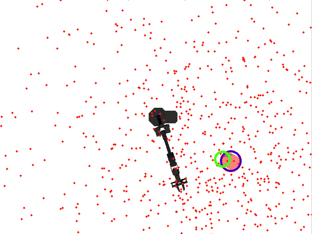
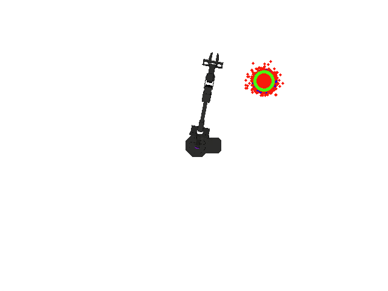
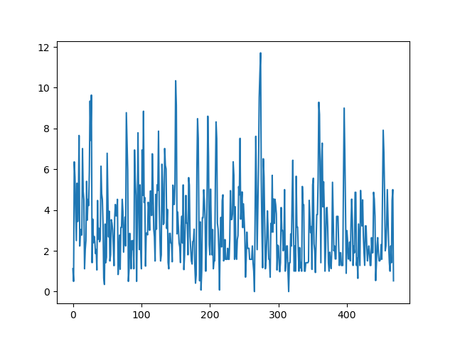
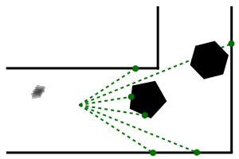

# Homework 3: State Estimation

## Overview 
In this project, you will implement the particle filter algorithm for MuSHR car and Widowx250 arm robot.

## Setup
Download skeleton code at https://github.coecis.cornell.edu/nlc62/cs4750_hw3
```
# Open a terminal
$ cd ~/Downloads
$ unzip cs4750_hw3-main.zip
$ mv ~/Downloads/cs4750_hw3-main/hw3_state_estimation/ ~/homework_ws/src/cs4750_student
$ cd ~/homework_ws
$ catkin build
$ source ~/homework_ws/devel/setup.bash
$ roscd arm_particle_filter/
$ chmod +x test/tracking.py
```

## Section 1: Object tracking for Widowx 250 Arm (90 points)
Object tracking refers to locating moving objects over time upon initial detection of the object. One of the main advantages of using tracking algorithms is robustness to noise and occlusions during object detection. For a variety of tasks involving robot arms, like visual servoing and in-hand manipulation, it is crucial to accurately detect and track the target object. Visual servoing involves controlling a robot arm using feedback from vision-based sensors. We have designed a toy visual servoing experiment with the arm end-effector following a cylinder moving around it. In the experiment setup, we use RGB image obtained from a camera placed above the robot arm capturing the top down view. In this section, you will track the moving cylinder by implementing the particle filter algorithm.

### \# Code Review
Your particle filter keeps track of the possible states i.e. positions of the cylinder using particles and weights, which are NumPy arrays of shape (M, 2) and (M,) respectively. Each particle is a candidate state, and the weight represents its probability.

We’ve provided a `ParticleFilter` class in `src/arm_particle_filter/particle_filter.py`. In addition, we also provide the code to initialize the robot arm and animate a moving cylinder around the arm in `src/arm_particle_filter/init_env.py`. The `CylinderTracker.get_detection` method in `src/arm_particle_filter/tracker.py` provides the position for the detected cylinder and the `ParticleFilter` keeps track of the detected object. This tracked position is used to command the end-effector of the WidowX 250 arm.  You will also implement the `LowVarianceSampler` class for particle resampling in `src/arm_particle_filter/resampler.py`.

Implement the three main steps i.e *predict*, *update* and *resample* for the `ParticleFilter`. Your implementations must modify the entries of the particles and weights NumPy arrays in-place<sup>[1](#1)</sup>.

**Q1.1** Begin by implementing the `ParticleFilter.predict` method. For a cylinder, we can simply apply a noisy constant velocity model to the particles. First add u * dt and then add noise with zero mean and standard deviation of u. In the predict step, try to modify self.particles in place and more information on how to do that can be found below. 

**Q1.2** Next, implement the `ParticleFilter.update` to update the particle weights by obtaining the observation from the detector. To calculate the likelihood for each particle, use the distance of the particle farthest away from the observation subtracted by the distance of the considered particle from observation which can be denoted by `max(distance) - distance`. In the update step, try to modify self.weights in place. 

After implementing these two methods, you should expect to pass all the tests in:
```
python3 test/particle_filter.py
```
Note: vectorizing matrix operations is necessary for passing the test cases so try to avoid using for loops. 

**Q1.3** Finally, you need to implement the `LowVarianceSampler.resample` method to replace particles with low or negligible weights with particles with high proximity to particles with higher weights. Make sure to reset all the weights so that each particle has an equal likelihood of being the ground truth. After completing this, you should expect to pass all the tests in:
```
python3 test/resample.py
```

Run the following command to start the visual servoing demo.
```
roslaunch arm_particle_filter tracking.launch
```
You should be able to see the red particles attempting to tracking the moving cylinder.

<figure>
  
  <figcaption> Example particle Filter with untuned parameters. The red points are particles. the blue circle is the observation obtained from detector. the green circle is the estimated position from particle filter, and the black object is the robot arm.</figcaption>
</figure> 

Now that you have a working object tracker. Then next step is to tune the parameters of your implementation of particle filter to improve the tracking performance and chase down the cylinder more closely.

**Q1.4** Head over to `arm_particle_filter/tracker.py`. You will find the following parameters that need to be tuned to improve the overall tracking performance. Keep in mind that the particle filter will break if the cylinder intersects with the robot arm at any point during the simulation. 
```
# Number of particles to be initialized for the particle filter
num_particles = 1000

# Constant velocity to be supplied to ParticleFilter.predict
self.constant_vel = np.array([0, 0])

# Sample motion model noise with this std=std_constant_vel
std_constant_vel = 100

# Initial mean and covariance of the sampled particles
initial_mean = np.array([320, 320]).reshape((-1, 1))
initial_cov = np.diag([10e7, 10e7])

```
We will evaluate your performance using the mean position error. Upon tuning, run the following command.
```
rostest arm_particle_filter tracking.test
```
After successfully tuning the parameters, you should be able to pass the above test. 

<figure>
  
  <figcaption> Example particle Filter with tuned parameters.</figcaption>
</figure> 

You should also find a new plot tracking the position error across time at `~/.ros/position_error.png`. It will look like the following:
<figure>
  
  <figcaption> Example Position error across time plot</figcaption>
</figure> 

**Please include this in your figure in your submission**. Place this figure in a new folder named `figures` in your submission so that its relative path inside the submission is: `/hw3_state_estimation/figures/position_error.png`

<details>
<summary>Rubric</summary>

+ resample, 4 tests (10 points each)
+ particle filter, 3 tests (10 points each)
+ tuning test (10 points)
+ position_error.png (10 points)
</details>

## Section 2: Localization for MuSHR car (30 points)

<figure>
  
</figure> 

Besides object tracking, particle filters are also popularly used for localization. The particle filter for the MuSHR car localization depends on the motion model of the car, the sensor model i.e. the observation model using Laser sensor readings. You already implemented the motion model for the MuSHR car as part of the Kinematics homework. For now, we provide a ROS wrapper class `KinematicCarMotionModelROS` in `src/localization/motion_model.py` for accessing the same set of methods that you already implemented earlier. In addition, we also provide you with a pre-implemented sensor model for the MuSHR car. Make sure you have already implemented the `LowVarianceSampler` in the previous section as we would be reusing it.

You are tasked with the responsibility of appropriately initializing the particle and corresponding weights i.e. implement the initialization step for the particle filter in `src/localization/particle_filter.py`.

We use a raycasting library called rangelibc (implemented in C++/CUDA), which casts rays into the map from the robot’s state and measures the distance to any obstacle/wall the ray encounters. This is similar to how the physical LIDAR unit measures distances.

If you see a range_libc folder in your home directory, start with the second command. Otherwise, download the zip file from https://github.coecis.cornell.edu/fb266/range_libc.git.

```
# Open a terminal
$ cd ~/Downloads
$ unzip range_libc-main.zip
$ mv ~/Downloads/range_libc-main ~/
$ cd ~/
$ cd range_libc-main
$ cd pywrapper 
$ python3 setup.py install --user
```

**Q2.1**: Implement the method `ParticleInitializer.reset_click_pose`, which initializes the belief of the robot `src/localization/particle_filter.py`. Given a [geometry_msgs/Pose](http://docs.ros.org/en/noetic/api/geometry_msgs/html/msg/Pose.html) message describing the robot’s initial state, your code should initialize the particles by sampling from this Gaussian distribution.

After completing **Q2.1**, expect your code to pass all the test cases when running 
```
roscd localization
python3 test/particle_initializer.py
```
You can test your particle filter in simulation with:
```
$ roslaunch localization particle_filter_teleop_sim.launch map:='$(find cs4750)/maps/cse2_2.yaml'
```

By default, this will initialize a simulation with the robot at the origin and open a tailored RViz view of the world. To reposition the robot in simulation, you must now use the “Publish Point” tool in the RViz toolbar: select the tool then click where on the map you want the robot to be. You’ll see the green pose arrow move to that position in a default orientation. Your particle filter will also be initialized by default. After moving the robot with “Publish Point”, you should reinitialize it by using the “2D Pose Estimate Tool”. Select the tool, then click on the position you want to specify and drag in the desired direction.

As you drive the vehicle around, you should see your particle filter approximately correspond to the true pose of the robot.

<details>
<summary>Rubric</summary>

+ 2 test, 15 points each
</details>

## Submission
Zip your homework code and submit to Gradescope. Due date: Nov. 2nd. 

```
$ cd ~/homework_ws/src/cs4750_student
$ zip -r hw3_state_estimation.zip hw3_state_estimation
```
---
<a name="1">1</a> Read more about in-place updates in python [here](https://www.interviewcake.com/concept/python/in-place).
