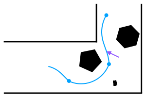
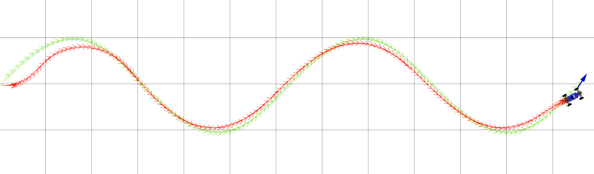
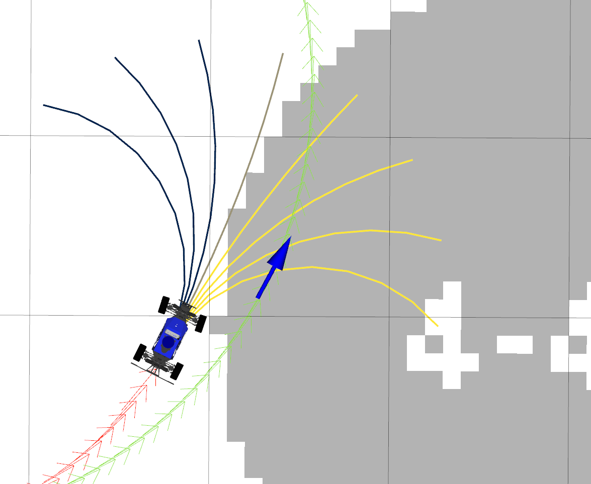
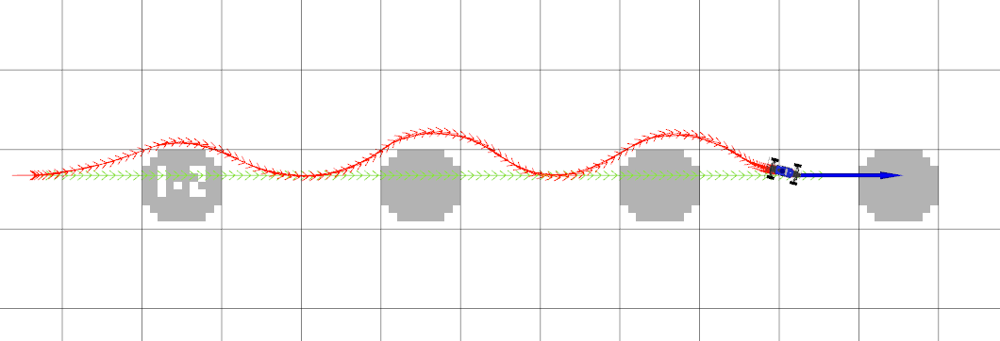

# Homework 5: Control



## Overview
In this homework, you will implement several fundamental path tracking control algorithms: PD and MPC<sup>[1](#1)</sup>. To accurately track the desired paths, you will tune the parameters that govern their behavior. As a result, you will also become familiar with the strengths and weaknesses of the various feedback control strategies discussed in this course. To note, since PD controller is a special case of PID, we name it PID in this homework (See Q2 for details).

## Code Overview

We decompose the problem of computing the robot’s actions into two components: motion planning and control. A motion planning algorithm generates an ideal **reference path**, while a feedback controller uses the robot’s current state (e.g. from the `localization` package) to follow this reference path. In this project, we will use a series of pre-programmed paths.

We’ve provided a `BaseController` class in `car_controller/src/control/controller.py`. The controllers you will implement (`PIDController`, `ModelPredictiveController`) extend this base class.

The ControlROS class in `car_controller/src/control/control_ros.py` provides a ROS interface to the controller classes. ControlROS provides a [ROS service](http://wiki.ros.org/Services) defined by `FollowPath.srv`. This service accepts a request (consisting of a `nav_msgs/Path` and desired speed) and asks the controller to track the geometric path at that speed. While the controller is tracking the path, `ControlROS` also publishes to several visualization topics.

The control loop is implemented in `BaseController. BaseController.get_reference_index` selects a reference state from the path. Each subclass implements controller-specific logic in the `get_error` and `get_control` methods. In order to operate at the desired control rate<sup>[2](#2)</sup>, your implementations of all three methods must be efficient. Try to vectorize where you can!

The reference paths being tracked by your controllers have reference velocities, and are represented as NumPy arrays of shape (L, 4). Paths with velocity information are named `path_xytv`, while paths without velocity information are named path_xyt (A path_xyt is a converted nav_msgs/Path message, represented as a NumPy array of shape (L, 3). ControlROS adds velocity information to create path_xytv before sending that to your controllers.). Here `xy` is the position of the car, and `t` is the heading angle. Similarly, a reference state with velocity information is named `reference_xytv`.

The control vectors returned by `get_control` contain both velocity and steering angle. In this project, the velocity should be copied directly from the reference velocity. The commanded steering angle will come from your PID/MPC logic.

>Implementing MPC will require more time than the other two controllers. Please plan accordingly.

## \# Q1.  Reference State Selection and Error Computation (20 points)

**Q1.1:** In `car_controller/src/control/controller.py`, implement the `BaseController.get_reference_index` method to select a reference state from the path that is about `distance_lookahead` from the current robot state (`src/control/controller.py`). This will be used as the target state for your controllers. To avoid selecting a reference state that would take the robot backwards, you should first compute the closest waypoint on the path and only consider states on the path that come after this closest waypoint.

To compute a reference state that is some lookahead distance away, we recommend first finding the state on the path that is closest to the current vehicle state. Then, step along the path’s waypoints and select the index of the first state that is greater than the lookahead distance from the current state. If no such state exists, you can simply return the final state.

You can verify your implementation on the provided test suite by running `python3 test/controller.py`. Your code should pass all test cases starting with `test_get_reference_index`.

**Q1.2:** Implement the `compute_position_in_frame` function in `src/car_controller/controller.py`. You may find the following derivation useful. This function will be used by your PID controllers: the PID error which is the distance between current car position and a waypoint position expressed in the waypoint coordinate frame defined by $(x_{ref}, y_{ref}, \theta_{ref})$.

<details>
<summary>Computing the Error in a New Coordinate Frame</summary>

Let $p = (x, y)$ be the current car position, and $F$ be the waypoint position coordinate frame defined by the state $(x_F, y_F, \theta_F)$. Then, the error expressed in frame $F$ is $F_p$.


</details>
<br>

After completing Q1.1 and Q1.2, expect your code to pass all the test cases in `test/controller.py`.

## \# Q2. PD Pure Pursuit Controller (20 points)
The proportional-integral-derivative (PID) controller is a feedback control mechanism that is simple to implement and widely used. It is often defined as 
$$u(t) = - (K_p e(t) + K_i\int_0^t e(t')dt' + K_d\frac{de(t)}{dt})$$
where $K_p, K_i, K_d,$ are all non-negative coefficients for the proportional, integral, and derivative terms of the error $e(t)$ at time $t$. 
Here $u(t)$ is negative since the error is defined as `current_state - reference_state`.  
In this project, we will actually implement a PD controller, which drops the integral term. Since PD control is a special kind of PID control where $K_i = 0$, in the following part we call the controller PID control.

Consider what happens when we pass the car's current position and a reference position to the `compute_position_in_frame` function you implemented in Q1.2. `compute_position_in_frame` will return the position of the car in the reference point's frame. This gives us the along-track and cross-track error we need for PID! We provide a function `get_error` which uses your implementation of `compute_position_in_frame` to return a two-element NumPy array comprised of along-track and cross-track error i.e. $[e_{at}, e_{ct}]$. As you learned in lecture, the PD pure pursuit algorithm uses cross-track error and heading error, ignoring along-track error. We will thus ignore the $e_{at}$ term returned by `get_error`. You can compute the heading error, $e_{\theta}$, by computing the difference between your current pose orientation and the reference pose orientation.

**Q2.1** Implement the PD control law in `PID.get_control`. The returned control should be a two-element NumPy array $[v, \alpha]$ where $v$ is copied from the reference velocity and $\alpha$ is the result of the PD control law. Hint: the derivative of the heading error can be written analytically as $\frac{de_{\theta}}{dt} = vsin(\theta - \theta_{ref}).$ 

You can verify your implementation on the provided test suite by running `python3 test/pid.py`.

## \# Exploring PID Parameters
The PD pure pursuit controller is controlled by the gains $K_p, K_d$. We’ve provided some initial values in `config/parameters.yaml`; note that $K_i$ = 0 since our implementation is a PD controller. It’ll be up to you to tune the gains $K_p, K_d$ to achieve good path tracking performance. You may use the Ziegler–Nichols method discussed in class for tuning.

> Tune your gains $K_p, K_d$ to achieve good tracking performance for the reference paths: ```circle```, ```left-turn```, and ```wave```. In your writeup, briefly explain your tuning process and justify your final gains. (Instructions for sending reference paths are in the next section.)

After tuning your gains, evaluate your implementation on the different paths. Visualize your tracking performance using the steps below, and include screenshots of your car's executed path for the ```circle```, ```left-turn```, and ```wave``` paths. We will be grading your PD performance based on these plots. Include them in your writeup. 

### \# Controller Visualization Tools

To evaluate your controller with reference paths, we’ll launch our environment across a few terminals. Remember to source each terminal!

Open one terminal and run:

`roslaunch cs4750 teleop.launch teleop:=false`

In another, launch a controller (with your choice of pid or mpc):

`roslaunch car_controller controller.launch type:=pid`

Now, to see the controller node’s visualization data:

`rosrun rviz rviz -d $(rospack find car_controller)/config/control.rviz`

Finally, send a reference path to the controller. The available path names are: `wave`, `circle`, and `left-turn`.

`rosrun car_controller path_sender line`

In the RViz window, you should see a visualization of the reference path you’ve selected, as well as how the MuSHR car moves according to the PD controller. Here is a snapshot of the staff solution PD controller tracking the default `wave` path. To test the robustness of your controller, you can also vary the parameters of the paths and the initial state of the car. Learn more about the path parameterizations by running `path_sender` with the `-h` flag.


<br>
<br>

## \# Q3. PD controller in WidowX250 (10 points)

**Q3.1** 
$$u(t) = -(K_p e(t) + K_i\int_0^t e(t')dt' + K_d\frac{de(t)}{dt})$$
Implement the PD controller for robot arm in `src/arm_controller/pid_controller`. Note that we are ignoring the integral term, thus this is a PD controller, not a PID controller. Since we are publishing velocity at a high frequency, $\frac{de(t)}{dt}$ can be as simple as the difference between current error and error at last iteration multiplied by frequency $\frac{de(t)}{dt} = (e - e_{ref})*\text{frequency}$. 
Here the robot joint state is represented by joint position. You can get current robot joint states by using the self.current_position, and variable self.refs is the current goal configuration. You can get error in each joint by calculating current position minus reference position. 

Your implementation should pass `python3 test/pid.py` in `arm_controller/test`.

To visualize the robot moving around, run 
```
roslaunch arm_controller run_controller.launch
```
To change the path taken by the robot arm, you can modify the waypoints in ```arm_controller/scripts/run_pid.py```.

## \# Q4. Model-Predictive Controller (MPC) (40 points)

Although the PD pure pursuit controller you’ve implemented can be adequate in some driving conditions, additional factors may affect path tracking in practice. For example, nearby obstacles may require segments of the path to be tracked more closely, but are not incorporated into these simple controllers. More generally, these controllers are **myopic**: they reason solely about the current action and do not predict how that might impact future actions.

MPC proceeds in two phases. First, it uses a model to solve a $T$-horizon optimization problem. This problem is defined by a **cost function** $J$ that penalizes states and actions (e.g., states that are in collision); the solution is a sequence of $T - 1$ actions that minimizes cost. Next, the system will execute the first action and update the current estimated state. The process repeats from this new estimated state.

In your implementation, we will separate the optimization into four steps.

+ Sample $K$ sequences of $T - 1$ controls (`sample_controls`).
+ Use the kinematic car model from HW2.2 to **rollout** the resulting $T$-length sequence of states, including the current estimated state (`get_rollout`).
+ Compute the cost of each rollout from the $T$ resulting states (`compute_rollout_cost`).
+ Of the $K$ rollouts, select the rollout with the lowest cost and return the first action from this sequence (`get_control`).

**Q4.1:** Implement ```MPC.sample_controls```. This function should return a three-dimensional NumPy array with shape $(K, T-1, 2)$, representing $K$ sequences of $T - 1$ controls (velocity and steering angle). In your implementation, each of the sequences corresponds to a particular steering angle, applied $T - 1$ times.
The steering angles in the $K$ sequences should evenly span the range of the steering angle, defined by `self.min_alpha` and `self.max_alpha`. (Note that the velocity returned by this method is a placeholder, which will be replaced by the reference velocity in the next question. This is computed once per path tracking request for efficiency.)

After completing Q4.1, expect your code to pass the test_sample_controls test case in `test/mpc.py`.

**Q4.2:** Implement ```MPC.get_rollout```. This function should return a three-dimensional NumPy array with shape $(K, T, 3)$, representing $K$ sequences of $T$ resulting states $(x, y, \theta)$. The first pose of each rollout should always be the current pose. To compute the change in state for each step of the rollout, call `self.motion_model.compute_changes` (which you implemented in HW 2.2). Remember to vectorize your implementation as much as you can!

After completing Q4.2, expect your code to pass the `test_get_rollout` test case in `test/mpc.py`.

**Q4.3:** We’ve implemented `MPC.compute_rollout_cost` to call two components of the cost function: `MPC.compute_distance_cost`and `MPC.compute_collision_cost`. This cost function penalizes the rollout based on the distance between the final state and the reference state, as well as how many of the states in the rollout would result in collisions. The distance should be weighted by `self.error_w` and the collision cost should be weighted by `self.collision_w`. Implement both of these methods. (You should not change `compute_rollout_cost`.)

After completing Q4.3, expect your code to pass the cost-related test cases in `test/mpc.py`.

Tuning the parameters of a cost function requires principled design, iteration, and testing. We’ve asked you to implement a specific cost function with two terms and pre-specified weights, but these are all parameters that would be tuned in practice.


 <figure>
  
  <figcaption>MPC rollouts, colored by cost. Yellow rollouts have high cost due to collisions and black ones have low cost. The green one is the reference path, and the red one is the actual car trajectory.</figcaption>
</figure> 

**Q4.4:** Implement `MPC.get_control` to solve the $T$-horizon optimization problem. We’ve provided the logic for setting `self.sampled_controls` to match the reference velocity, so it’s ready for computing the rollout. Call the methods you’ve already implemented to fill in values for `rollouts` and `costs`, select the rollout with the lowest cost, and return the first action from this sequence.


## \# Exploring MPC Parameters

MPC is controlled by the parameters `K` and `T` in `config/parameters.yaml`, which you should tune to achieve good path tracking performance. In particular, MPC should now allow you to track paths around obstacles that aren’t accounted for by the planner (Figure below). (The reference paths from `path_sender` don’t consider obstacles at all.)

We’ve also provided a fun new map under `cs4750/maps` for you to play around in: `slalom_world`. MPC should be able to navigate around these obstacles! Start the simulator with this new map.

`roslaunch cs4750 teleop.launch teleop:=false map:='$(find cs4750)/maps/slalom_world.yaml'`

You can set different initial positions with the “Publish Point” RViz tool to try navigating around different slaloms. Then, launch MPC and issue a reference path. You may want to evaluate your controller with different path parameters.

In terminal two, launch a controller:

`roslaunch car_controller controller.launch type:=mpc`

Now, to see the controller node’s visualization data:

`rosrun rviz rviz -d $(rospack find car_controller)/config/control.rviz`

Finally, open another terminal and run `rosrun car_controller path_sender line` to command the car to move in a line. See the controller visualization section above for other possible reference paths. 

 <figure>
  
  <figcaption>MPC avoiding obstacles in the slalom_world map while tracking the line path.</figcaption>
</figure> 

Follow the same steps from above to evaluate the tracking performance of your tuned MPC implementation.

```
rostest car_controller controller_performance.test type:=mpc
```
> Tune the MPC parameters $K$, $T$, and distance_lookahead to achieve good tracking performance (the car should avoid hitting the obstacles in the world). In your writeup, briefly explain your tuning process and justify your final parameters. What makes the saw path so difficult to track?

## \# Q5. Written Control Problem (10 points)(Required for Graduate Students)

Please see the HW5 Ed post for the question description.

## \# Submission

Submit both written and coding assignments on Gradescope. Ensure that you have justified your parameter tuning in your writeup, and included all three plots. The written assignment is for graduate students only, no submission is required for undergraduate students. 

---
<a name="1">1</a> The controllers you will implement have been used in the [DARPA Grand Challenge](http://robots.stanford.edu/papers/thrun.stanley05.pdf) and [DARPA Urban Challenge](https://www.ri.cmu.edu/pub_files/pub4/urmson_christopher_2008_1/urmson_christopher_2008_1.pdf) among many other scenarios.


<a name="2">2</a> Our PID implementation operate at ~50 Hz. Our tuned MPC operates at ~25 Hz, trading off a higher control frequency for a longer search horizon.
